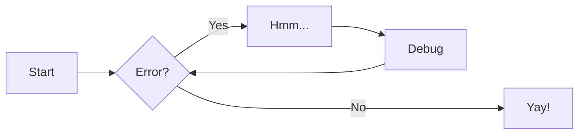

# Image insert


# Insert a piece of code

```commandline
docker compose up
```

```python
def create_docs():
    print(123)
```


:memo: go and study

:notebook: of math

## Tasks
 - :white_check_mark:  create project
 - [] create site

## Tables
| content | another_column |    Notes |
|:--------|:--------------:|---------:|
| my data |      air       | my_data2 | 

